# CopilotHub Implementation Backlog DAG

> Generated for CopilotHub (Tauri 2.x + React 19 + Rust).
> All UI items require Fluent 2 compliance: Segoe UI Variable, 4px grid,
> Fluent 2 color tokens, elevation shadows, motion tokens, rounded corners.
> Reference: https://fluent2.microsoft.design/

---

## 1. Dependency Graph (Mermaid DAG)

```mermaid
%%{ init: { "theme": "base", "themeVariables": { "lineColor": "#555" } } }%%
graph TD
    classDef area1 fill:#4F6D7A,stroke:#2C3E50,color:#fff
    classDef area2 fill:#6B5B95,stroke:#3D3066,color:#fff
    classDef area3 fill:#88B04B,stroke:#4A6A1A,color:#fff
    classDef area4 fill:#D65076,stroke:#8C2040,color:#fff
    classDef area5 fill:#DD9933,stroke:#A06B1A,color:#fff
    classDef area6 fill:#45B8AC,stroke:#267A72,color:#fff
    classDef critical stroke-width:4px,stroke:#C0392B

    %% ── Area 1: Multi-Provider AI Chat ──
    A1["1. ai-provider-abstraction<br/>M | ALL"]:::area1
    A2["2. openai-provider<br/>M | O"]:::area1
    A3["3. anthropic-provider<br/>M | A"]:::area1
    A4["4. dayour-provider<br/>M | D"]:::area1
    A5["5. chat-store-multi-provider<br/>L | ALL"]:::area1
    A6["6. provider-switch-ui<br/>M | ALL"]:::area1
    A7["7. streaming-renderer<br/>M | ALL"]:::area1
    A8["8. comparison-view<br/>L | ALL"]:::area1

    A1 --> A2
    A1 --> A3
    A1 --> A4
    A1 --> A5
    A5 --> A6
    A5 --> A7
    A7 --> A8
    A6 --> A8

    %% ── Area 2: Enhanced MCP ──
    B9["9. mcp-provider-adapters<br/>M | ALL"]:::area2
    B10["10. advanced-action-routing<br/>M | ALL"]:::area2
    B11["11. ai-runbook-generation<br/>L | ALL"]:::area2

    A1 --> B9
    B9 --> B10
    A1 --> B11

    %% ── Area 3: Enterprise ──
    C12["12. entra-sso-completion<br/>L | ALL"]:::area3
    C13["13. keyvault-integration<br/>L | ALL"]:::area3
    C14["14. secure-provider-config<br/>M | ALL"]:::area3

    C12 --> C13
    C13 --> C14
    A1 --> C14

    %% ── Area 4: Performance ──
    D15["15. bundle-optimization<br/>M | ALL"]:::area4
    D16["16. render-perf<br/>M | ALL"]:::area4
    D17["17. sidecar-perf<br/>M | ALL"]:::area4

    %% ── Area 5: Testing ──
    E18["18. provider-tests<br/>M | ALL"]:::area5
    E19["19. integration-tests<br/>L | ALL"]:::area5
    E20["20. e2e-smoke<br/>L | ALL"]:::area5

    A2 --> E18
    A3 --> E18
    A4 --> E18
    A8 --> E19

    %% ── Area 6: Docs & Packaging ──
    F21["21. api-docs<br/>S | ALL"]:::area6
    F22["22. msix-polish<br/>M | ALL"]:::area6

    A1 --> F21

    %% ── Critical path highlight ──
    class A1 critical
    class A5 critical
    class A7 critical
    class A8 critical
    class E19 critical
```



**Legend:**

| Color       | Area                          |
|-------------|-------------------------------|
| Dark teal   | Area 1 -- Multi-Provider Chat |
| Purple      | Area 2 -- Enhanced MCP        |
| Green       | Area 3 -- Enterprise          |
| Rose        | Area 4 -- Performance         |
| Amber       | Area 5 -- Testing             |
| Cyan        | Area 6 -- Docs and Packaging  |

Red thick border marks items on the critical path.

---

## 2. Summary Table (Topological Order)

Items with no dependencies appear first. Within each tier, items are listed
by ID.

| Tier | ID | Title | Description / Files Affected | Dependencies | Complexity | Lane | Parallel |
|------|----|-------|------------------------------|--------------|------------|------|----------|
| 0 | 1  | ai-provider-abstraction | New `src/lib/aiProvider.ts` -- abstract provider interface defining chat, streaming, model listing, and error contracts. | none | M | ALL | yes |
| 0 | 12 | entra-sso-completion | Modify `src/lib/entraAuth.ts`, `src/hooks/useEntraAuth.ts` -- token refresh loop, session persistence to Tauri store, conditional access error handling. | none | L | ALL | yes |
| 0 | 15 | bundle-optimization | Modify `vite.config.ts` -- route-level code splitting via `React.lazy`, dynamic imports for heavy deps (xterm.js, Mermaid), Rollup manual chunks, tree-shaking audit. | none | M | ALL | yes |
| 0 | 16 | render-perf | Modify components consuming large lists (ChatMessageList, RunbookMarketplace) -- React 19 `<Suspense>` boundaries, `useTransition` for provider switches, virtualized message list via `@tanstack/virtual`. Fluent 2 motion tokens for transition animations. | none | M | ALL | yes |
| 0 | 17 | sidecar-perf | Modify `src/lib/mcpClient.ts` -- connection pooling for MCP HTTP/SSE, request batching, configurable timeouts, retry with exponential backoff. | none | M | ALL | yes |
| 0 | 20 | e2e-smoke | New `tests/e2e/` -- Playwright tests covering: app launch, tab create/close, chat send/receive, runbook load/run, provider switch. Runs against Tauri dev server. | none | L | ALL | yes |
| 0 | 22 | msix-polish | Modify `src-tauri/tauri.conf.json`, new packaging scripts -- MSIX bundle config, NSIS installer, Intune Win32 metadata (detection rules, requirements), code-signing placeholder. | none | M | ALL | yes |
| 1 | 2  | openai-provider | New `src/lib/providers/openai.ts` -- implements provider interface for OpenAI Chat Completions API, handles SSE streaming, function calling, token counting. | 1 | M | O | yes |
| 1 | 3  | anthropic-provider | New `src/lib/providers/anthropic.ts` -- implements provider interface for Anthropic Messages API, handles SSE streaming, tool use blocks, token counting. | 1 | M | A | yes |
| 1 | 4  | dayour-provider | New `src/lib/providers/dayour.ts` -- implements provider interface for Dayour custom endpoints, handles streaming, custom auth header injection. | 1 | M | D | yes |
| 1 | 5  | chat-store-multi-provider | Modify `src/store/chatStore.ts` -- add `activeProvider` slice, per-conversation provider binding, provider-specific message history, Zustand immer actions for provider CRUD. | 1 | L | ALL | yes |
| 1 | 9  | mcp-provider-adapters | Extend `src/lib/mcpRegistry.ts` -- adapter layer that maps MCP tool schemas to provider-specific function/tool calling formats (OpenAI functions, Anthropic tool_use, Dayour actions). | 1 | M | ALL | yes |
| 1 | 11 | ai-runbook-generation | Extend `src/lib/runbookExecutor.ts`, new `src/lib/runbookAI.ts` -- use provider interface to generate YAML runbook steps from natural language, validate against runbook schema, insert into editor. | 1 | L | ALL | yes |
| 1 | 13 | keyvault-integration | New `src/lib/keyVault.ts`, new Rust command in `src-tauri/src/commands/` -- Azure Key Vault secret resolution via `@azure/keyvault-secrets` on TS side, optional Rust-side `azure_identity` for native token. | 12 | L | ALL | no |
| 1 | 21 | api-docs | New `typedoc.json`, doc comments in `src/lib/aiProvider.ts` -- TypeDoc config targeting provider layer, CI script to generate HTML docs into `docs/api/`. | 1 | S | ALL | yes |
| 2 | 6  | provider-switch-ui | New `src/components/ProviderSwitch.tsx` -- Fluent 2 segmented control or dropdown. Uses Segoe UI Variable, Fluent 2 `colorNeutralBackground1` / `colorBrandBackground` tokens, 4px grid spacing, `borderRadiusMedium`, `shadow4` elevation. Reads/writes chatStore activeProvider. | 5 | M | ALL | no |
| 2 | 7  | streaming-renderer | Modify `src/components/ChatMessageList.tsx` -- unified streaming decoder handling OpenAI delta, Anthropic content_block_delta, Dayour chunks. Progressive Markdown rendering. Fluent 2 `durationNormal` / `curveEasyEase` motion tokens for message appearance. | 5 | M | ALL | no |
| 2 | 10 | advanced-action-routing | Extend `src/lib/actionMode.ts` -- provider-capability matrix, cost/latency heuristic routing, fallback chain when a provider lacks a tool. | 9 | M | ALL | no |
| 2 | 14 | secure-provider-config | Modify `src/lib/config.ts` -- resolve provider API keys from Key Vault URIs at startup, cache decrypted keys in memory, clear on session end. | 13, 1 | M | ALL | no |
| 2 | 18 | provider-tests | New `tests/unit/providers/` -- Vitest suites for openai, anthropic, dayour providers. Mock HTTP responses, verify streaming, error handling, token counting. | 2, 3, 4 | M | ALL | no |
| 3 | 8  | comparison-view | New `src/components/ComparisonView.tsx` -- side-by-side Fluent 2 card layout. Cards use `shadow8` elevation, `borderRadiusLarge`, `colorNeutralBackground1`. 4px grid gap. `durationSlow` / `curveDecelerateMax` motion for panel open. Synchronized scroll. Reads multiple provider streams. | 7, 6 | L | ALL | no |
| 4 | 19 | integration-tests | New `tests/integration/` -- Vitest + MSW tests: multi-provider chat round-trip, provider switching mid-conversation, comparison view rendering, MCP tool invocation across providers. | 8 | L | ALL | no |

---

## 3. Critical Path Analysis

The critical path is the longest dependency chain determining the minimum
project duration. Each node shows the complexity weight (S=1, M=2, L=3, XL=5).

```
ai-provider-abstraction (M=2)
  --> chat-store-multi-provider (L=3)
    --> streaming-renderer (M=2)
      --> comparison-view (L=3)
        --> integration-tests (L=3)
```

**Critical path length: 5 items, total weight: 13 units.**

| Step | Item | Cumulative Weight |
|------|------|-------------------|
| 1 | 1. ai-provider-abstraction | 2 |
| 2 | 5. chat-store-multi-provider | 5 |
| 3 | 7. streaming-renderer | 7 |
| 4 | 8. comparison-view | 10 |
| 5 | 19. integration-tests | 13 |

Secondary long chains (near-critical):

- Chain B: 1 --> 5 --> 6 --> 8 --> 19 (weight 13, same length, shares the
  critical path via item 8).
- Chain C: 12 --> 13 --> 14 (weight 8, enterprise track).
- Chain D: 1 --> 9 --> 10 (weight 6, MCP track).

**Implication:** Items 1 and 5 are the highest-priority starts. Any delay on
the critical path delays the entire project. The enterprise chain (12-13-14)
runs fully independent and should start in parallel with Area 1.

---

## 4. Lane Assignment Recommendations

Lanes represent ownership domains. O = OpenAI specialist, A = Anthropic
specialist, D = Dayour specialist, ALL = full team / any engineer.

| Lane | Assigned Items | Justification |
|------|---------------|---------------|
| ALL | 1, 5, 6, 7, 8, 9, 10, 11, 12, 13, 14, 15, 16, 17, 18, 19, 20, 21, 22 | Core infrastructure, shared UI, enterprise, perf, testing, and packaging require cross-cutting knowledge. Any team member can own these. |
| O | 2 (openai-provider) | Requires deep knowledge of OpenAI Chat Completions API, function calling schema, tiktoken token counting, and SSE delta format. Assign to engineer with OpenAI API experience. |
| A | 3 (anthropic-provider) | Requires deep knowledge of Anthropic Messages API, tool_use block format, content_block_delta streaming, and Claude-specific token counting. Assign to engineer with Anthropic API experience. |
| D | 4 (dayour-provider) | Requires knowledge of Dayour internal endpoints, custom auth mechanisms, and proprietary streaming format. Assign to engineer with Dayour platform access. |

**Staffing note:** Items 2, 3, and 4 are fully independent of each other
once item 1 completes. They are the ideal parallelism window for three
engineers working simultaneously. After those complete, item 18
(provider-tests) can be picked up by any of the three.

---

## 5. Parallelism Windows

Each window represents a set of items that can execute concurrently once
their dependencies are satisfied.

### Window 0 -- No dependencies (immediate start)

All seven items below can begin on day one in parallel:

| Item | Complexity | Notes |
|------|-----------|-------|
| 1. ai-provider-abstraction | M | CRITICAL PATH. Start first. |
| 12. entra-sso-completion | L | Independent enterprise track. |
| 15. bundle-optimization | M | Independent perf track. |
| 16. render-perf | M | Independent perf track. |
| 17. sidecar-perf | M | Independent perf track. |
| 20. e2e-smoke | L | Can scaffold test harness early. |
| 22. msix-polish | M | Independent packaging track. |

**Maximum parallelism: 7 items across 7 engineers.**

### Window 1 -- After ai-provider-abstraction completes

| Item | Complexity | Notes |
|------|-----------|-------|
| 2. openai-provider | M | Lane O. |
| 3. anthropic-provider | M | Lane A. |
| 4. dayour-provider | M | Lane D. |
| 5. chat-store-multi-provider | L | CRITICAL PATH. |
| 9. mcp-provider-adapters | M | MCP track. |
| 11. ai-runbook-generation | L | Runbook track. |
| 21. api-docs | S | Low effort, can start immediately. |

**Maximum parallelism: 7 items (3 provider impls can run simultaneously).**

### Window 1e -- After entra-sso-completion completes

| Item | Complexity | Notes |
|------|-----------|-------|
| 13. keyvault-integration | L | Depends only on 12. |

### Window 2 -- After chat-store-multi-provider completes

| Item | Complexity | Notes |
|------|-----------|-------|
| 6. provider-switch-ui | M | Fluent 2 segmented control. |
| 7. streaming-renderer | M | CRITICAL PATH. |

**These two can run in parallel.**

### Window 2m -- After mcp-provider-adapters completes

| Item | Complexity | Notes |
|------|-----------|-------|
| 10. advanced-action-routing | M | MCP track continues. |

### Window 2e -- After keyvault-integration and ai-provider-abstraction complete

| Item | Complexity | Notes |
|------|-----------|-------|
| 14. secure-provider-config | M | Enterprise track merges with provider track. |

### Window 2t -- After all three provider implementations complete

| Item | Complexity | Notes |
|------|-----------|-------|
| 18. provider-tests | M | Can begin once 2, 3, 4 are done. |

### Window 3 -- After streaming-renderer and provider-switch-ui complete

| Item | Complexity | Notes |
|------|-----------|-------|
| 8. comparison-view | L | CRITICAL PATH. Fluent 2 card layout. |

### Window 4 -- After comparison-view completes

| Item | Complexity | Notes |
|------|-----------|-------|
| 19. integration-tests | L | CRITICAL PATH terminal node. |

---

## 6. Recommended Execution Timeline

Below is a phased execution plan assuming a team of 3-4 engineers.

```
Phase 1 (Week 1-2):  Items 1, 12, 15, 16, 17, 20, 22
                      [7 items, all independent, max parallelism]

Phase 2 (Week 2-3):  Items 2, 3, 4, 5, 9, 11, 21, 13
                      [8 items, high parallelism after item 1 lands]

Phase 3 (Week 3-4):  Items 6, 7, 10, 14, 18
                      [5 items, moderate parallelism]

Phase 4 (Week 4-5):  Item 8
                      [1 item, critical path bottleneck -- comparison view]

Phase 5 (Week 5):    Item 19
                      [1 item, integration testing -- validates everything]
```

---

## 7. Fluent 2 Design Requirements Summary

Every UI-facing item (6, 7, 8, 16) must comply with the following Fluent 2
standards per https://fluent2.microsoft.design/:

| Requirement | Token / Value | Applies To |
|-------------|---------------|------------|
| Typography | Segoe UI Variable, font weight 400/600 | All text elements |
| Grid | 4px base grid, 8px content spacing | All layout containers |
| Color -- surface | `colorNeutralBackground1`, `colorNeutralBackground2` | Cards, panels, dropdowns |
| Color -- brand | `colorBrandBackground`, `colorBrandForeground1` | Active states, selected provider |
| Border radius | `borderRadiusMedium` (4px), `borderRadiusLarge` (8px) | Buttons, cards, dropdowns |
| Elevation | `shadow4` (subtle), `shadow8` (cards), `shadow16` (modals) | Cards, comparison panels |
| Motion -- duration | `durationNormal` (200ms), `durationSlow` (300ms) | Message appear, panel open |
| Motion -- curve | `curveEasyEase`, `curveDecelerateMax` | Transitions, panel animations |
| Focus | `strokeWidthThick` (2px) visible focus ring | All interactive elements |
| Contrast | WCAG 2.1 AA minimum 4.5:1 text, 3:1 UI | All color combinations |

---

## 8. Raw Adjacency List

For tooling consumption (e.g., DAG schedulers, CI dependency graphs):

```
1  -> 2, 3, 4, 5, 9, 11, 14, 21
2  -> 18
3  -> 18
4  -> 18
5  -> 6, 7
6  -> 8
7  -> 8
8  -> 19
9  -> 10
10 -> (none)
11 -> (none)
12 -> 13
13 -> 14
14 -> (none)
15 -> (none)
16 -> (none)
17 -> (none)
18 -> (none)
19 -> (none)
20 -> (none)
21 -> (none)
22 -> (none)
```

Leaf nodes (no downstream dependents): 10, 11, 14, 15, 16, 17, 18, 19, 20,
21, 22.

Root nodes (no upstream dependencies): 1, 12, 15, 16, 17, 20, 22.
