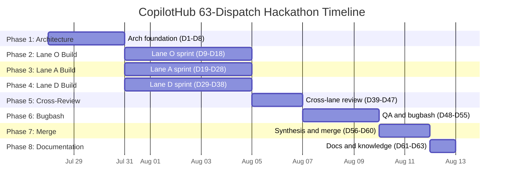

# CopilotHub 63-Agent Dispatch Plan

**Version:** 1.0
**Applies To:** CopilotHub 3-Lane Hackathon (Tauri 2.x + React 19 + Rust)
**Design System:** Microsoft Fluent 2 (https://fluent2.microsoft.design/)
**Backlog Reference:** backlog-dag.md (22 items, DAG IDs 1-22)
**Scoring Reference:** scoring-rubric.md (7 dimensions, Fluent 2 = 20%)
**Protocol Reference:** hackathon-protocol.md (3 lanes: O, A, D)
**Bugbash Reference:** bugbash-pattern.md (dual-phase validation)

---

## Executive Summary

This plan specifies exactly 63 agent dispatches across 8 phases, orchestrating
the full hackathon lifecycle from architecture through documentation. Three
competing lanes (O=OpenAI, A=Anthropic, D=Dayour) independently build, then
cross-review, bugbash, and merge into a single integration branch.

**Total dispatches: 63**

---

## Summary Table

| Phase | Name                         | Dispatches | Count | Primary Agents                                        | Max Parallelism |
|-------|------------------------------|------------|-------|-------------------------------------------------------|-----------------|
| 1     | Architecture Foundation      | 1-8        | 8     | dayour-architect, dayour-swe, dayour-design, dayour-azure | 4               |
| 2     | Build Sprint: Lane O         | 9-18       | 10    | dayour-swe, dayour-design                              | 3               |
| 3     | Build Sprint: Lane A         | 19-28      | 10    | dayour-swe, dayour-design                              | 3               |
| 4     | Build Sprint: Lane D         | 29-38      | 10    | dayour-swe, dayour-design, dayour-studio               | 3               |
| 5     | Cross-Lane Review            | 39-47      | 9     | dayour-swe, dayour-design, dayour-evaluation           | 3               |
| 6     | QA / Bugbash                 | 48-55      | 8     | dayour-swe, dayour-evaluation                          | 4               |
| 7     | Synthesis + Merge            | 56-60      | 5     | dayour-architect, dayour-swarm, dayour-swe             | 2               |
| 8     | Documentation + Knowledge    | 61-63      | 3     | dayour-word, dayour-flashcard, dayour-notes            | 3               |
|       | **TOTAL**                    |            | **63**|                                                         |                 |

---

## Phase Sequencing (Mermaid Gantt)



**Key constraint:** Phases 2, 3, and 4 run in parallel after Phase 1.
Phase 5 starts only after all three build sprints complete. Phases 6-8
are strictly sequential.

---

## Model Usage Breakdown

| Model               | Dispatch Count | Primary Use                                    |
|----------------------|---------------|------------------------------------------------|
| claude-opus-4.6      | 10            | Architecture decisions, cross-review, synthesis |
| claude-sonnet-4.6    | 14            | Lane A code gen, design reviews, scoring        |
| claude-haiku-4.5     | 5             | Flashcards, notes, lightweight audits           |
| gpt-5.3-codex        | 10            | Lane O code gen                                 |
| gpt-5.1-codex        | 7             | Lane O tests, secondary code gen                |
| gpt-5-mini           | 3             | Quick validation, lightweight tasks             |
| default              | 14            | Agent-native model selection                    |
| **TOTAL**            | **63**        |                                                 |

---

## Agent Usage Breakdown

| Agent              | Dispatch Count | Roles                                                    |
|--------------------|---------------|----------------------------------------------------------|
| dayour-swe         | 25            | Implementation, testing, code review, merge, bug fixing   |
| dayour-design      | 12            | Fluent 2 token mapping, compliance audits, component patterns |
| dayour-architect   | 5             | Architecture design, ADRs, integrity review, merge strategy |
| dayour-evaluation  | 7             | Automated scoring, quality gates, regression testing       |
| dayour-azure       | 2             | Entra SSO architecture, KeyVault integration design        |
| dayour-swarm       | 2             | Dispatch coordination, merge orchestration                 |
| dayour-studio      | 2             | Agent design, Copilot Studio integration for Lane D        |
| dayour-word        | 3             | Technical documentation, runbooks, final report            |
| dayour-flashcard   | 2             | Knowledge cards, cross-agent dissemination                 |
| dayour-notes       | 1             | Session distillation, lessons learned                      |
| dayour-copilot     | 1             | Copilot extensibility review                               |
| dayour-github      | 1             | Branch management, PR coordination                         |
| **TOTAL**          | **63**        |                                                            |

---

## Phase 1 -- Architecture Foundation (Dispatches 1-8)

**Goal:** Establish shared architecture, Fluent 2 token system, provider
abstraction, and enterprise identity design that ALL lanes build upon.

**Parallelism window:** Dispatches 1-4 run in parallel (independent concerns).
Dispatches 5-6 depend on D1. Dispatches 7-8 depend on D5.

```
Parallel block A: [D1] [D2] [D3] [D4]
                     |              |
Sequential:        [D5] [D6]       |
                     |              |
Sequential:        [D7] [D8] ------+
```

---

### Dispatch 1

| Field           | Value |
|-----------------|-------|
| Phase           | 1 -- Architecture Foundation |
| Agent           | dayour-architect |
| Model           | claude-opus-4.6 |
| Mode            | sync |
| Lane            | CROSS |
| Backlog Items   | 1 (ai-provider-abstraction) |
| Dependencies    | None |
| Input Context   | hackathon-protocol.md, backlog-dag.md, scoring-rubric.md, CopilotHub src/types/ directory, existing Zustand store patterns |
| Expected Output | Architecture Decision Record (ADR) for the unified provider interface. TypeScript interface definitions for AIProvider, StreamAdapter, ProviderConfig. Discriminated union for provider types. Error contract types. File: src/types/providers.ts |

### Dispatch 2

| Field           | Value |
|-----------------|-------|
| Phase           | 1 -- Architecture Foundation |
| Agent           | dayour-design |
| Model           | claude-sonnet-4.6 |
| Mode            | sync |
| Lane            | CROSS |
| Backlog Items   | 6, 7, 8 (UI items -- token foundation) |
| Dependencies    | None |
| Input Context   | Fluent 2 design reference (https://fluent2.microsoft.design/), hackathon-protocol.md Fluent 2 mandate section, scoring-rubric.md Dimension B, existing Tailwind config |
| Expected Output | Fluent 2 token mapping document: CSS custom properties mapped to Fluent 2 tokens for color, spacing, typography, elevation, motion, border-radius. Tailwind CSS 4 theme extension config. Component pattern library spec (cards, segmented controls, streaming message bubbles). File: src/styles/fluent2-tokens.css, tailwind.config.ts updates |

### Dispatch 3

| Field           | Value |
|-----------------|-------|
| Phase           | 1 -- Architecture Foundation |
| Agent           | dayour-azure |
| Model           | claude-opus-4.6 |
| Mode            | sync |
| Lane            | CROSS |
| Backlog Items   | 12 (entra-sso-completion), 13 (keyvault-integration) |
| Dependencies    | None |
| Input Context   | Existing src/lib/entraAuth.ts, src/hooks/useEntraAuth.ts, Tauri secure store API docs, Azure Key Vault SDK reference, hackathon-protocol.md enterprise features |
| Expected Output | Enterprise identity architecture spec: Entra token flow diagram, silent refresh strategy, conditional access error taxonomy, KeyVault secret resolution pipeline, Rust sidecar integration points for azure_identity. Sequence diagrams for SSO and secret retrieval flows |

### Dispatch 4

| Field           | Value |
|-----------------|-------|
| Phase           | 1 -- Architecture Foundation |
| Agent           | dayour-swe |
| Model           | claude-sonnet-4.6 |
| Mode            | sync |
| Lane            | CROSS |
| Backlog Items   | 9 (mcp-provider-adapters), 10 (advanced-action-routing) |
| Dependencies    | None |
| Input Context   | Existing src/lib/mcpClient.ts, src/lib/mcpRegistry.ts, MCP protocol spec, backlog-dag.md items 9-10 |
| Expected Output | MCP adapter layer design: typed adapter interface mapping MCP tool schemas to provider-specific formats (OpenAI function calling, Anthropic tool_use, Dayour actions). Routing heuristic spec: cost/latency matrix, fallback chain logic. Files: design notes + stub interfaces in src/lib/mcp/ |

### Dispatch 5

| Field           | Value |
|-----------------|-------|
| Phase           | 1 -- Architecture Foundation |
| Agent           | dayour-swe |
| Model           | claude-sonnet-4.6 |
| Mode            | sync |
| Lane            | CROSS |
| Backlog Items   | 1 (ai-provider-abstraction), 5 (chat-store-multi-provider) |
| Dependencies    | D1 |
| Input Context   | Output of D1 (provider interface types), existing src/store/chatStore.ts, Zustand immer patterns from codebase |
| Expected Output | Scaffolded provider abstraction implementation: src/lib/aiProvider.ts (abstract base), src/store/chatStore.ts modifications (activeProvider slice, per-conversation provider binding, immer actions). Shared foundation code that all three lanes will extend |

### Dispatch 6

| Field           | Value |
|-----------------|-------|
| Phase           | 1 -- Architecture Foundation |
| Agent           | dayour-design |
| Model           | default |
| Mode            | sync |
| Lane            | CROSS |
| Backlog Items   | 16 (render-perf) |
| Dependencies    | D2 |
| Input Context   | Output of D2 (Fluent 2 token mapping), existing ChatMessageList component, React 19 Suspense/useTransition patterns, tanstack/virtual API |
| Expected Output | Component performance patterns document: React 19 Suspense boundary placement, useTransition integration points, virtualized list configuration for ChatMessageList. Fluent 2 motion tokens for message appearance animations. Reusable patterns for all lanes |

### Dispatch 7

| Field           | Value |
|-----------------|-------|
| Phase           | 1 -- Architecture Foundation |
| Agent           | dayour-swe |
| Model           | default |
| Mode            | sync |
| Lane            | CROSS |
| Backlog Items   | 20 (e2e-smoke), 18 (provider-tests foundation) |
| Dependencies    | D5 |
| Input Context   | Output of D5 (scaffolded provider layer), existing test infrastructure, Vitest config, Playwright setup |
| Expected Output | Test harness foundation: tests/unit/providers/ directory with mock infrastructure (MSW handlers for OpenAI, Anthropic, Dayour endpoints), tests/e2e/ Playwright config targeting Tauri dev server, shared test utilities (provider factory, stream simulator). All lanes will add their specific tests on top |

### Dispatch 8

| Field           | Value |
|-----------------|-------|
| Phase           | 1 -- Architecture Foundation |
| Agent           | dayour-github |
| Model           | default |
| Mode            | sync |
| Lane            | CROSS |
| Backlog Items   | None (infrastructure) |
| Dependencies    | D5 |
| Input Context   | hackathon-protocol.md branch naming conventions, backlog-dag.md lane assignments, output of D5 (shared foundation) |
| Expected Output | Branch structure creation: lane-o/main, lane-a/main, lane-d/main branches off current main with shared foundation code from D5 applied. PR templates for each lane. Branch protection rules documented |

---

## Phase 2 -- Build Sprint: Lane O / OpenAI (Dispatches 9-18)

**Goal:** Lane O implements its assigned backlog items using OpenAI models.
All code gen uses gpt-5.3-codex or gpt-5.1-codex. Each implementation
dispatch is followed by or paired with a Fluent 2 design review.

**Parallelism window:** D9-D11 run in parallel (independent providers/features).
D12 depends on D9. D13 depends on D12. D14-D15 depend on D13.
D16 depends on D14+D15. D17 depends on D16. D18 depends on all.

```
Parallel block: [D9] [D10] [D11]
                  |
Sequential:     [D12] -> [D13] -> [D14] + [D15] -> [D16] -> [D17] -> [D18]
```

---

### Dispatch 9

| Field           | Value |
|-----------------|-------|
| Phase           | 2 -- Build Sprint: Lane O |
| Agent           | dayour-swe |
| Model           | gpt-5.3-codex |
| Mode            | background |
| Lane            | O |
| Backlog Items   | 2 (openai-provider) |
| Dependencies    | D5 |
| Input Context   | Provider interface from D1/D5, OpenAI Chat Completions API docs, SSE streaming spec, function calling schema, tiktoken token counting |
| Expected Output | src/lib/providers/openai.ts -- full OpenAI provider implementation: chat completions, SSE streaming with delta handling, function calling support, token counting via tiktoken, error handling with retry logic, AbortController support |

### Dispatch 10

| Field           | Value |
|-----------------|-------|
| Phase           | 2 -- Build Sprint: Lane O |
| Agent           | dayour-swe |
| Model           | gpt-5.3-codex |
| Mode            | background |
| Lane            | O |
| Backlog Items   | 9 (mcp-provider-adapters -- O's take) |
| Dependencies    | D4, D5 |
| Input Context   | MCP adapter design from D4, provider abstraction from D5, OpenAI function calling format, existing mcpRegistry.ts |
| Expected Output | src/lib/mcp/openaiAdapter.ts -- MCP-to-OpenAI function calling adapter. Maps MCP tool schemas to OpenAI functions format. Handles tool call chaining. Integrates with sidecar bridge |

### Dispatch 11

| Field           | Value |
|-----------------|-------|
| Phase           | 2 -- Build Sprint: Lane O |
| Agent           | dayour-swe |
| Model           | gpt-5.1-codex |
| Mode            | background |
| Lane            | O |
| Backlog Items   | 15 (bundle-optimization), 17 (sidecar-perf) |
| Dependencies    | D5 |
| Input Context   | Existing vite.config.ts, src/lib/mcpClient.ts, bundle size baseline, React.lazy patterns |
| Expected Output | vite.config.ts updates for route-level code splitting, dynamic imports for xterm.js/Mermaid, Rollup manual chunks. mcpClient.ts updates for connection pooling, request batching, configurable timeouts, exponential backoff retry |

### Dispatch 12

| Field           | Value |
|-----------------|-------|
| Phase           | 2 -- Build Sprint: Lane O |
| Agent           | dayour-design |
| Model           | gpt-5.1-codex |
| Mode            | sync |
| Lane            | O |
| Backlog Items   | 6 (provider-switch-ui -- O's take) |
| Dependencies    | D9 |
| Input Context   | Fluent 2 token mapping from D2, chatStore activeProvider slice from D5, Fluent 2 segmented control reference, scoring-rubric.md Dimension B |
| Expected Output | Fluent 2 compliance review of Lane O's provider-switch-ui design, then implementation: src/components/ProviderSwitch.tsx -- Fluent 2 segmented control using colorNeutralBackground1, colorBrandBackground tokens, 4px grid spacing, borderRadiusMedium, shadow4 elevation. Reads/writes chatStore activeProvider |

### Dispatch 13

| Field           | Value |
|-----------------|-------|
| Phase           | 2 -- Build Sprint: Lane O |
| Agent           | dayour-swe |
| Model           | gpt-5.3-codex |
| Mode            | sync |
| Lane            | O |
| Backlog Items   | 7 (streaming-renderer -- O's take) |
| Dependencies    | D12 |
| Input Context   | OpenAI provider from D9, chatStore from D5, Fluent 2 motion tokens from D2, existing ChatMessageList.tsx |
| Expected Output | src/components/ChatMessageList.tsx modifications -- unified streaming decoder for OpenAI delta format, progressive Markdown rendering, Fluent 2 durationNormal/curveEasyEase motion tokens for message appearance, backpressure handling |

### Dispatch 14

| Field           | Value |
|-----------------|-------|
| Phase           | 2 -- Build Sprint: Lane O |
| Agent           | dayour-swe |
| Model           | gpt-5.3-codex |
| Mode            | background |
| Lane            | O |
| Backlog Items   | 8 (comparison-view -- O's take) |
| Dependencies    | D13 |
| Input Context   | Streaming renderer from D13, provider-switch-ui from D12, Fluent 2 card patterns from D2, scoring-rubric.md elevation requirements |
| Expected Output | src/components/ComparisonView.tsx -- side-by-side Fluent 2 card layout. Cards use shadow2 at rest, shadow4 on hover, borderRadiusLarge, colorNeutralBackground1. 4px grid gap. durationSlow/curveDecelerateMax motion for panel open. Synchronized scroll. Multi-provider stream display |

### Dispatch 15

| Field           | Value |
|-----------------|-------|
| Phase           | 2 -- Build Sprint: Lane O |
| Agent           | dayour-design |
| Model           | gpt-5-mini |
| Mode            | sync |
| Lane            | O |
| Backlog Items   | 8 (comparison-view -- Fluent 2 audit) |
| Dependencies    | D14 |
| Input Context   | ComparisonView output from D14, Fluent 2 compliance checklist from hackathon-protocol.md, scoring-rubric.md Dimension B section B.4 (elevation), B.5 (motion) |
| Expected Output | Fluent 2 compliance audit report for Lane O ComparisonView: token usage verification (colors, spacing, typography, elevation, motion), density mode check, dark/light theme verification. List of violations with fix instructions |

### Dispatch 16

| Field           | Value |
|-----------------|-------|
| Phase           | 2 -- Build Sprint: Lane O |
| Agent           | dayour-swe |
| Model           | gpt-5.1-codex |
| Mode            | sync |
| Lane            | O |
| Backlog Items   | 18 (provider-tests -- O's tests) |
| Dependencies    | D9, D14, D15 |
| Input Context   | Test harness from D7, OpenAI provider from D9, comparison view from D14, audit fixes from D15 |
| Expected Output | tests/unit/providers/openai.test.ts -- Vitest suite: mock HTTP responses via MSW, verify streaming delta handling, function calling serialization, error handling, token counting. tests/unit/components/ComparisonView.test.tsx -- render tests with Fluent 2 token verification |

### Dispatch 17

| Field           | Value |
|-----------------|-------|
| Phase           | 2 -- Build Sprint: Lane O |
| Agent           | dayour-swe |
| Model           | gpt-5.1-codex |
| Mode            | sync |
| Lane            | O |
| Backlog Items   | 19 (integration-tests -- O's portion) |
| Dependencies    | D16 |
| Input Context   | All Lane O implementations (D9-D16), test harness from D7, MSW mock infrastructure |
| Expected Output | tests/integration/lane-o/ -- Vitest + MSW integration tests: multi-provider chat round-trip with OpenAI, provider switching mid-conversation, comparison view rendering with dual streams, MCP tool invocation through OpenAI adapter |

### Dispatch 18

| Field           | Value |
|-----------------|-------|
| Phase           | 2 -- Build Sprint: Lane O |
| Agent           | dayour-evaluation |
| Model           | default |
| Mode            | sync |
| Lane            | O |
| Backlog Items   | All Lane O items (automated gate validation) |
| Dependencies    | D17 |
| Input Context   | Full Lane O branch, automated gate commands from bugbash-pattern.md, Fluent 2 token audit script from scoring-rubric.md |
| Expected Output | Lane O automated gate results: tsc --noEmit status, vitest run pass rate, regression check, bundle size delta, Fluent 2 token audit (hardcoded hex/rgb scan). Gate pass/fail summary. Blocking issues list if any |

---

## Phase 3 -- Build Sprint: Lane A / Anthropic (Dispatches 19-28)

**Goal:** Lane A implements its assigned backlog items using Anthropic models.
All code gen uses claude-opus-4.6 or claude-sonnet-4.6.

**Parallelism window:** D19-D21 run in parallel. D22 depends on D19.
D23 depends on D22. D24-D25 depend on D23. D26 depends on D24+D25.
D27 depends on D26. D28 depends on all.

```
Parallel block: [D19] [D20] [D21]
                  |
Sequential:     [D22] -> [D23] -> [D24] + [D25] -> [D26] -> [D27] -> [D28]
```

---

### Dispatch 19

| Field           | Value |
|-----------------|-------|
| Phase           | 3 -- Build Sprint: Lane A |
| Agent           | dayour-swe |
| Model           | claude-opus-4.6 |
| Mode            | background |
| Lane            | A |
| Backlog Items   | 3 (anthropic-provider) |
| Dependencies    | D5 |
| Input Context   | Provider interface from D1/D5, Anthropic Messages API docs, content_block_delta streaming, tool_use block format, token counting |
| Expected Output | src/lib/providers/anthropic.ts -- full Anthropic provider implementation: Messages API integration, SSE streaming with content_block_delta handling, tool_use support, token counting, error handling with retry, AbortController support |

### Dispatch 20

| Field           | Value |
|-----------------|-------|
| Phase           | 3 -- Build Sprint: Lane A |
| Agent           | dayour-swe |
| Model           | claude-sonnet-4.6 |
| Mode            | background |
| Lane            | A |
| Backlog Items   | 9 (mcp-provider-adapters -- A's take) |
| Dependencies    | D4, D5 |
| Input Context   | MCP adapter design from D4, provider abstraction from D5, Anthropic tool_use format, existing mcpRegistry.ts |
| Expected Output | src/lib/mcp/anthropicAdapter.ts -- MCP-to-Anthropic tool_use adapter. Maps MCP tool schemas to Anthropic tool blocks. Handles tool result blocks. Integrates with sidecar bridge |

### Dispatch 21

| Field           | Value |
|-----------------|-------|
| Phase           | 3 -- Build Sprint: Lane A |
| Agent           | dayour-swe |
| Model           | claude-sonnet-4.6 |
| Mode            | background |
| Lane            | A |
| Backlog Items   | 11 (ai-runbook-generation) |
| Dependencies    | D5 |
| Input Context   | Provider abstraction from D5, existing src/lib/runbookExecutor.ts, runbook YAML schema, Anthropic long-context capabilities |
| Expected Output | src/lib/runbookAI.ts -- AI-assisted runbook step generation: takes runbook skeleton, generates step-by-step YAML instructions via active provider, validates against runbook schema, returns editable output. Integration with existing runbook system |

### Dispatch 22

| Field           | Value |
|-----------------|-------|
| Phase           | 3 -- Build Sprint: Lane A |
| Agent           | dayour-design |
| Model           | claude-sonnet-4.6 |
| Mode            | sync |
| Lane            | A |
| Backlog Items   | 6 (provider-switch-ui -- A's take) |
| Dependencies    | D19 |
| Input Context   | Fluent 2 token mapping from D2, chatStore from D5, Fluent 2 dropdown/segmented control patterns, scoring-rubric.md Dimension B |
| Expected Output | Fluent 2 compliance review + implementation: src/components/ProviderSwitch.tsx (Lane A variant) -- Fluent 2 dropdown with provider icons, colorNeutralBackground2 surface, brand accent on selection, spacingHorizontalM padding, borderRadiusMedium, proper focus ring with strokeWidthThick |

### Dispatch 23

| Field           | Value |
|-----------------|-------|
| Phase           | 3 -- Build Sprint: Lane A |
| Agent           | dayour-swe |
| Model           | claude-opus-4.6 |
| Mode            | sync |
| Lane            | A |
| Backlog Items   | 7 (streaming-renderer -- A's take) |
| Dependencies    | D22 |
| Input Context   | Anthropic provider from D19, chatStore from D5, Fluent 2 motion tokens from D2, existing ChatMessageList.tsx |
| Expected Output | src/components/ChatMessageList.tsx modifications (Lane A variant) -- streaming decoder for Anthropic content_block_delta format, progressive Markdown rendering with citation support, Fluent 2 motion tokens, backpressure handling, thinking block display |

### Dispatch 24

| Field           | Value |
|-----------------|-------|
| Phase           | 3 -- Build Sprint: Lane A |
| Agent           | dayour-swe |
| Model           | claude-opus-4.6 |
| Mode            | background |
| Lane            | A |
| Backlog Items   | 8 (comparison-view -- A's take) |
| Dependencies    | D23 |
| Input Context   | Streaming renderer from D23, provider-switch-ui from D22, Fluent 2 card patterns from D2 |
| Expected Output | src/components/ComparisonView.tsx (Lane A variant) -- side-by-side card layout with Fluent 2 elevation (shadow2 rest, shadow4 hover), borderRadiusLarge, synchronized scroll, multi-provider stream rendering, user rating UI with Fluent 2 star/thumb patterns |

### Dispatch 25

| Field           | Value |
|-----------------|-------|
| Phase           | 3 -- Build Sprint: Lane A |
| Agent           | dayour-design |
| Model           | claude-sonnet-4.6 |
| Mode            | sync |
| Lane            | A |
| Backlog Items   | 8 (comparison-view -- Fluent 2 audit), 11 (runbook UI -- Fluent 2 audit) |
| Dependencies    | D24 |
| Input Context   | ComparisonView from D24, runbookAI from D21, Fluent 2 compliance checklist, scoring-rubric.md Dimension B |
| Expected Output | Fluent 2 compliance audit for Lane A: comparison-view token audit, runbook generation UI token audit, density mode verification, dark/light theme check. Violation list with specific fix instructions |

### Dispatch 26

| Field           | Value |
|-----------------|-------|
| Phase           | 3 -- Build Sprint: Lane A |
| Agent           | dayour-swe |
| Model           | claude-sonnet-4.6 |
| Mode            | sync |
| Lane            | A |
| Backlog Items   | 18 (provider-tests -- A's tests) |
| Dependencies    | D19, D24, D25 |
| Input Context   | Test harness from D7, Anthropic provider from D19, comparison view from D24, audit fixes from D25 |
| Expected Output | tests/unit/providers/anthropic.test.ts -- Vitest suite: mock Anthropic Messages API, verify content_block_delta streaming, tool_use serialization, error handling. tests/unit/components/ComparisonView-A.test.tsx. tests/unit/lib/runbookAI.test.ts |

### Dispatch 27

| Field           | Value |
|-----------------|-------|
| Phase           | 3 -- Build Sprint: Lane A |
| Agent           | dayour-swe |
| Model           | claude-sonnet-4.6 |
| Mode            | sync |
| Lane            | A |
| Backlog Items   | 19 (integration-tests -- A's portion) |
| Dependencies    | D26 |
| Input Context   | All Lane A implementations (D19-D26), test harness from D7, MSW mock infrastructure |
| Expected Output | tests/integration/lane-a/ -- integration tests: multi-provider chat with Anthropic, provider switching, comparison view with dual streams, MCP tool invocation through Anthropic adapter, runbook generation round-trip |

### Dispatch 28

| Field           | Value |
|-----------------|-------|
| Phase           | 3 -- Build Sprint: Lane A |
| Agent           | dayour-evaluation |
| Model           | default |
| Mode            | sync |
| Lane            | A |
| Backlog Items   | All Lane A items (automated gate validation) |
| Dependencies    | D27 |
| Input Context   | Full Lane A branch, automated gate commands, Fluent 2 token audit script |
| Expected Output | Lane A automated gate results: tsc, vitest, regression, bundle delta, Fluent 2 audit. Gate pass/fail summary. Blocking issues list |

---

## Phase 4 -- Build Sprint: Lane D / Dayour (Dispatches 29-38)

**Goal:** Lane D implements using the DAYOURBOT fleet with mixed model
selection. Covers enterprise features (Entra SSO, KeyVault), chat store,
advanced routing, and secure config.

**Parallelism window:** D29-D31 run in parallel. D32 depends on D29.
D33 depends on D31. D34 depends on D32+D33. D35-D36 depend on D34.
D37 depends on D35+D36. D38 depends on all.

```
Parallel block: [D29] [D30] [D31]
                  |          |
Sequential:     [D32]      [D33]
                  |          |
Sequential:     [D34] ------+
                  |
Sequential:     [D35] + [D36] -> [D37] -> [D38]
```

---

### Dispatch 29

| Field           | Value |
|-----------------|-------|
| Phase           | 4 -- Build Sprint: Lane D |
| Agent           | dayour-swe |
| Model           | claude-sonnet-4.6 |
| Mode            | background |
| Lane            | D |
| Backlog Items   | 4 (dayour-provider) |
| Dependencies    | D5 |
| Input Context   | Provider interface from D1/D5, Dayour custom endpoint docs, custom auth header patterns, proprietary streaming format |
| Expected Output | src/lib/providers/dayour.ts -- full Dayour provider implementation: custom endpoint integration, streaming with proprietary chunk format, custom auth header injection, token counting, error handling with DAYOURBOT-specific error codes |

### Dispatch 30

| Field           | Value |
|-----------------|-------|
| Phase           | 4 -- Build Sprint: Lane D |
| Agent           | dayour-swe |
| Model           | default |
| Mode            | background |
| Lane            | D |
| Backlog Items   | 12 (entra-sso-completion) |
| Dependencies    | D3 |
| Input Context   | Enterprise architecture from D3, existing src/lib/entraAuth.ts, src/hooks/useEntraAuth.ts, Tauri secure store API |
| Expected Output | Complete Entra SSO implementation: token acquisition flow, silent refresh loop with configurable interval, conditional access error handling with user-facing prompts, session persistence to Tauri secure store. Files: src/lib/entraAuth.ts (modified), src/hooks/useEntraAuth.ts (modified) |

### Dispatch 31

| Field           | Value |
|-----------------|-------|
| Phase           | 4 -- Build Sprint: Lane D |
| Agent           | dayour-studio |
| Model           | claude-sonnet-4.6 |
| Mode            | background |
| Lane            | D |
| Backlog Items   | 10 (advanced-action-routing) |
| Dependencies    | D4 |
| Input Context   | MCP adapter design from D4, provider-capability matrix concept, cost/latency heuristics |
| Expected Output | src/lib/actionMode.ts (extended) -- provider-capability matrix with typed capabilities enum, cost/latency heuristic routing engine, fallback chain when provider lacks a tool, declarative routing config. Integrates with Copilot Studio agent patterns |

### Dispatch 32

| Field           | Value |
|-----------------|-------|
| Phase           | 4 -- Build Sprint: Lane D |
| Agent           | dayour-swe |
| Model           | default |
| Mode            | sync |
| Lane            | D |
| Backlog Items   | 5 (chat-store-multi-provider -- D's extensions), 6 (provider-switch-ui -- D's take) |
| Dependencies    | D29 |
| Input Context   | Dayour provider from D29, chatStore foundation from D5, Fluent 2 tokens from D2 |
| Expected Output | chatStore.ts enhancements for Dayour-specific features (DAYOURBOT fleet selection within provider). ProviderSwitch.tsx (Lane D variant) with Fluent 2 segmented control including fleet sub-selector, proper token usage throughout |

### Dispatch 33

| Field           | Value |
|-----------------|-------|
| Phase           | 4 -- Build Sprint: Lane D |
| Agent           | dayour-swe |
| Model           | default |
| Mode            | sync |
| Lane            | D |
| Backlog Items   | 13 (keyvault-integration) |
| Dependencies    | D30 |
| Input Context   | Enterprise architecture from D3, Entra SSO from D30, Azure Key Vault SDK, Rust azure_identity crate |
| Expected Output | src/lib/keyVault.ts -- Key Vault secret resolution via @azure/keyvault-secrets, Entra token passthrough. src-tauri/src/commands/keyvault.rs -- Rust command with azure_identity for native token acquisition. Configurable TTL cache. Error surfacing in UI |

### Dispatch 34

| Field           | Value |
|-----------------|-------|
| Phase           | 4 -- Build Sprint: Lane D |
| Agent           | dayour-swe |
| Model           | claude-sonnet-4.6 |
| Mode            | sync |
| Lane            | D |
| Backlog Items   | 14 (secure-provider-config) |
| Dependencies    | D32, D33 |
| Input Context   | KeyVault integration from D33, provider abstraction from D5, chatStore from D32 |
| Expected Output | src/lib/config.ts (modified) -- resolve provider API keys from Key Vault URIs at startup, cache decrypted keys in memory with secure wipe on session end, fallback to environment variables, error display using Fluent 2 status tokens (colorStatusDangerBackground1) |

### Dispatch 35

| Field           | Value |
|-----------------|-------|
| Phase           | 4 -- Build Sprint: Lane D |
| Agent           | dayour-design |
| Model           | default |
| Mode            | sync |
| Lane            | D |
| Backlog Items   | 7 (streaming-renderer -- D's take), 8 (comparison-view -- D's take) |
| Dependencies    | D34 |
| Input Context   | Dayour provider from D29, chatStore from D32, Fluent 2 tokens from D2, secure config from D34 |
| Expected Output | Lane D streaming renderer and comparison view with full Fluent 2 compliance: streaming-renderer with Dayour chunk format, comparison-view with shadow2/shadow4 elevation, borderRadiusLarge, durationSlow motion. Fluent 2 audit integrated into build process |

### Dispatch 36

| Field           | Value |
|-----------------|-------|
| Phase           | 4 -- Build Sprint: Lane D |
| Agent           | dayour-swe |
| Model           | default |
| Mode            | sync |
| Lane            | D |
| Backlog Items   | 18 (provider-tests -- D's tests) |
| Dependencies    | D29, D34, D35 |
| Input Context   | Test harness from D7, Dayour provider from D29, secure config from D34, UI components from D35 |
| Expected Output | tests/unit/providers/dayour.test.ts -- mock custom endpoints, verify proprietary streaming, auth header injection. tests/unit/lib/keyVault.test.ts -- mock Key Vault responses, TTL cache behavior. tests/unit/lib/config.test.ts -- Key Vault URI resolution tests |

### Dispatch 37

| Field           | Value |
|-----------------|-------|
| Phase           | 4 -- Build Sprint: Lane D |
| Agent           | dayour-swe |
| Model           | default |
| Mode            | sync |
| Lane            | D |
| Backlog Items   | 19 (integration-tests -- D's portion) |
| Dependencies    | D36 |
| Input Context   | All Lane D implementations (D29-D36), test harness from D7 |
| Expected Output | tests/integration/lane-d/ -- integration tests: Dayour provider chat, Entra SSO token flow mock, KeyVault secret resolution, secure config pipeline, advanced action routing with fallback chain, provider switching with fleet sub-selection |

### Dispatch 38

| Field           | Value |
|-----------------|-------|
| Phase           | 4 -- Build Sprint: Lane D |
| Agent           | dayour-evaluation |
| Model           | default |
| Mode            | sync |
| Lane            | D |
| Backlog Items   | All Lane D items (automated gate validation) |
| Dependencies    | D37 |
| Input Context   | Full Lane D branch, automated gate commands, Fluent 2 token audit script |
| Expected Output | Lane D automated gate results: tsc, vitest, regression, bundle delta, Fluent 2 audit. Gate pass/fail summary. Blocking issues list |

---

## Phase 5 -- Cross-Lane Review (Dispatches 39-47)

**Goal:** Each lane reviews the other two lanes. Per lane: 1 code review
dispatch + 1 Fluent 2 compliance audit + 1 automated scoring run = 3
dispatches per reviewing lane, 9 total.

**Parallelism window:** All three reviewing-lane blocks (D39-D41, D42-D44,
D45-D47) can run in parallel. Within each block, D+0 and D+1 run in
parallel; D+2 depends on both.

```
Lane O reviews A+D:  [D39] + [D40] -> [D41]
Lane A reviews O+D:  [D42] + [D43] -> [D44]     (all 3 blocks in parallel)
Lane D reviews O+A:  [D45] + [D46] -> [D47]
```

---

### Dispatch 39

| Field           | Value |
|-----------------|-------|
| Phase           | 5 -- Cross-Lane Review |
| Agent           | dayour-swe |
| Model           | gpt-5.3-codex |
| Mode            | background |
| Lane            | CROSS (O reviews A+D) |
| Backlog Items   | All Lane A + Lane D implementations |
| Dependencies    | D28, D38 |
| Input Context   | Lane A branch (D19-D28 outputs), Lane D branch (D29-D38 outputs), review template from hackathon-protocol.md, scoring-rubric.md dimensions A and D |
| Expected Output | Code review reports for Lane A and Lane D: strengths, weaknesses, suggestions per the cross-channel review template. Focus on code quality (Dim A), architecture fit (Dim D), error handling, TypeScript discipline, Zustand patterns, MCP integration correctness |

### Dispatch 40

| Field           | Value |
|-----------------|-------|
| Phase           | 5 -- Cross-Lane Review |
| Agent           | dayour-design |
| Model           | gpt-5.1-codex |
| Mode            | background |
| Lane            | CROSS (O audits A+D Fluent 2) |
| Backlog Items   | All UI components from Lane A + Lane D |
| Dependencies    | D28, D38 |
| Input Context   | Lane A UI components, Lane D UI components, Fluent 2 compliance checklist, scoring-rubric.md Dimension B (all subsections B.1-B.8) |
| Expected Output | Fluent 2 compliance audit reports for Lane A and Lane D: per-component token verification (color, spacing, typography, elevation, motion, border-radius), density mode check, dark/light theme verification, WCAG contrast ratios. Score 1-10 per lane with detailed justification |

### Dispatch 41

| Field           | Value |
|-----------------|-------|
| Phase           | 5 -- Cross-Lane Review |
| Agent           | dayour-evaluation |
| Model           | default |
| Mode            | sync |
| Lane            | CROSS (O scores A+D) |
| Backlog Items   | All Lane A + Lane D items |
| Dependencies    | D39, D40 |
| Input Context   | Code review from D39, Fluent 2 audit from D40, scoring-rubric.md all 7 dimensions, automated gate results from D28 and D38 |
| Expected Output | Scoring run: per-feature score sheets for Lane A and Lane D using the 7-dimension rubric (A: Code Quality, B: Fluent 2, C: UX, D: Architecture, E: Performance, F: Innovation, G: Completeness). Composite scores calculated. Merge recommendation per feature |

### Dispatch 42

| Field           | Value |
|-----------------|-------|
| Phase           | 5 -- Cross-Lane Review |
| Agent           | dayour-swe |
| Model           | claude-opus-4.6 |
| Mode            | background |
| Lane            | CROSS (A reviews O+D) |
| Backlog Items   | All Lane O + Lane D implementations |
| Dependencies    | D18, D38 |
| Input Context   | Lane O branch (D9-D18 outputs), Lane D branch (D29-D38 outputs), review template, scoring-rubric.md |
| Expected Output | Code review reports for Lane O and Lane D: strengths, weaknesses, suggestions. Focus on code quality, architecture fit, error handling, TypeScript discipline |

### Dispatch 43

| Field           | Value |
|-----------------|-------|
| Phase           | 5 -- Cross-Lane Review |
| Agent           | dayour-design |
| Model           | claude-sonnet-4.6 |
| Mode            | background |
| Lane            | CROSS (A audits O+D Fluent 2) |
| Backlog Items   | All UI components from Lane O + Lane D |
| Dependencies    | D18, D38 |
| Input Context   | Lane O UI components, Lane D UI components, Fluent 2 checklist, scoring-rubric.md Dimension B |
| Expected Output | Fluent 2 compliance audit reports for Lane O and Lane D: per-component token verification, density mode, theme check, WCAG contrast. Score 1-10 per lane |

### Dispatch 44

| Field           | Value |
|-----------------|-------|
| Phase           | 5 -- Cross-Lane Review |
| Agent           | dayour-evaluation |
| Model           | default |
| Mode            | sync |
| Lane            | CROSS (A scores O+D) |
| Backlog Items   | All Lane O + Lane D items |
| Dependencies    | D42, D43 |
| Input Context   | Code review from D42, Fluent 2 audit from D43, scoring-rubric.md, gate results from D18 and D38 |
| Expected Output | Scoring run: per-feature score sheets for Lane O and Lane D. 7-dimension composite scores. Merge recommendation per feature |

### Dispatch 45

| Field           | Value |
|-----------------|-------|
| Phase           | 5 -- Cross-Lane Review |
| Agent           | dayour-swe |
| Model           | claude-sonnet-4.6 |
| Mode            | background |
| Lane            | CROSS (D reviews O+A) |
| Backlog Items   | All Lane O + Lane A implementations |
| Dependencies    | D18, D28 |
| Input Context   | Lane O branch (D9-D18 outputs), Lane A branch (D19-D28 outputs), review template, scoring-rubric.md |
| Expected Output | Code review reports for Lane O and Lane A: strengths, weaknesses, suggestions. Focus on code quality, architecture fit, MCP patterns, Zustand discipline |

### Dispatch 46

| Field           | Value |
|-----------------|-------|
| Phase           | 5 -- Cross-Lane Review |
| Agent           | dayour-design |
| Model           | claude-sonnet-4.6 |
| Mode            | background |
| Lane            | CROSS (D audits O+A Fluent 2) |
| Backlog Items   | All UI components from Lane O + Lane A |
| Dependencies    | D18, D28 |
| Input Context   | Lane O UI components, Lane A UI components, Fluent 2 checklist, scoring-rubric.md Dimension B |
| Expected Output | Fluent 2 compliance audit reports for Lane O and Lane A: token verification, density mode, theme, WCAG. Score 1-10 per lane |

### Dispatch 47

| Field           | Value |
|-----------------|-------|
| Phase           | 5 -- Cross-Lane Review |
| Agent           | dayour-evaluation |
| Model           | default |
| Mode            | sync |
| Lane            | CROSS (D scores O+A) |
| Backlog Items   | All Lane O + Lane A items |
| Dependencies    | D45, D46 |
| Input Context   | Code review from D45, Fluent 2 audit from D46, scoring-rubric.md, gate results from D18 and D28 |
| Expected Output | Scoring run: per-feature score sheets for Lane O and Lane A. 7-dimension composite scores. Merge recommendation per feature |

---

## Phase 6 -- QA / Bugbash (Dispatches 48-55)

**Goal:** Execute the dual bugbash pattern from bugbash-pattern.md.
Phase 6a (D48-D51): Internal bugbash -- each lane self-validates.
Phase 6b (D52-D55): Cross-lane adversarial bugbash + triage.

**Parallelism window:** D48-D50 run in parallel (one per lane).
D51 depends on D48-D50. D52-D54 run in parallel.
D55 depends on D52-D54.

```
Phase 6a:  [D48] [D49] [D50]  (parallel, one per lane)
                  |
           [D51]               (Fluent 2 token audit -- all lanes)

Phase 6b:  [D52] [D53] [D54]  (parallel, adversarial cross-lane)
                  |
           [D55]               (triage + fix verification)
```

---

### Dispatch 48

| Field           | Value |
|-----------------|-------|
| Phase           | 6 -- QA / Bugbash |
| Agent           | dayour-swe |
| Model           | gpt-5.1-codex |
| Mode            | background |
| Lane            | O |
| Backlog Items   | All Lane O items (self-validation) |
| Dependencies    | D41, D44, D47 (all cross-reviews complete) |
| Input Context   | Lane O branch, cross-review feedback from D39-D47, bugbash-pattern.md Phase 1 checklist, automated gate commands |
| Expected Output | Internal bugbash results for Lane O: all 5 automated gates run (tsc, unit tests, build, regression, coverage). Manual self-review checklist completed. Feedback incorporation from cross-review findings. Bug fixes applied. Gate pass/fail report |

### Dispatch 49

| Field           | Value |
|-----------------|-------|
| Phase           | 6 -- QA / Bugbash |
| Agent           | dayour-swe |
| Model           | claude-opus-4.6 |
| Mode            | background |
| Lane            | A |
| Backlog Items   | All Lane A items (self-validation) |
| Dependencies    | D41, D44, D47 |
| Input Context   | Lane A branch, cross-review feedback from D39-D47, bugbash-pattern.md Phase 1 checklist |
| Expected Output | Internal bugbash results for Lane A: automated gates, self-review checklist, feedback incorporation, bug fixes, gate report |

### Dispatch 50

| Field           | Value |
|-----------------|-------|
| Phase           | 6 -- QA / Bugbash |
| Agent           | dayour-swe |
| Model           | default |
| Mode            | background |
| Lane            | D |
| Backlog Items   | All Lane D items (self-validation) |
| Dependencies    | D41, D44, D47 |
| Input Context   | Lane D branch, cross-review feedback from D39-D47, bugbash-pattern.md Phase 1 checklist |
| Expected Output | Internal bugbash results for Lane D: automated gates, self-review checklist, feedback incorporation, bug fixes, gate report |

### Dispatch 51

| Field           | Value |
|-----------------|-------|
| Phase           | 6 -- QA / Bugbash |
| Agent           | dayour-evaluation |
| Model           | default |
| Mode            | sync |
| Lane            | CROSS |
| Backlog Items   | Fluent 2 token audit -- all lanes |
| Dependencies    | D48, D49, D50 |
| Input Context   | All three lane branches post-self-validation, Fluent 2 token audit script from scoring-rubric.md, hardcoded hex/rgb grep patterns |
| Expected Output | Comprehensive Fluent 2 token audit across all three lanes: hardcoded color scan (hex, rgb, rgba, hsl), spacing audit (non-4px-grid values), typography audit (non-Segoe-UI-Variable fonts), elevation audit (non-shadow-token box-shadows), motion audit (non-token transitions). Per-lane violation count and file locations |

### Dispatch 52

| Field           | Value |
|-----------------|-------|
| Phase           | 6 -- QA / Bugbash |
| Agent           | dayour-swe |
| Model           | gpt-5.3-codex |
| Mode            | background |
| Lane            | CROSS (O tests A+D adversarially) |
| Backlog Items   | All Lane A + Lane D items |
| Dependencies    | D51 |
| Input Context   | Lane A and Lane D branches, bugbash-pattern.md Phase 2 adversarial focus areas, bug filing protocol |
| Expected Output | Adversarial bug reports filed against Lane A and Lane D: error injection results, state corruption tests, MCP edge cases, provider switching stress, concurrent operation tests, Fluent 2 visual regression checks. Bug reports in standardized format (ID, severity, priority, steps, expected/actual, Fluent 2 violation flag) |

### Dispatch 53

| Field           | Value |
|-----------------|-------|
| Phase           | 6 -- QA / Bugbash |
| Agent           | dayour-swe |
| Model           | claude-opus-4.6 |
| Mode            | background |
| Lane            | CROSS (A tests O+D adversarially) |
| Backlog Items   | All Lane O + Lane D items |
| Dependencies    | D51 |
| Input Context   | Lane O and Lane D branches, bugbash-pattern.md Phase 2 adversarial focus areas, bug filing protocol |
| Expected Output | Adversarial bug reports filed against Lane O and Lane D: same adversarial testing categories. Standardized bug reports |

### Dispatch 54

| Field           | Value |
|-----------------|-------|
| Phase           | 6 -- QA / Bugbash |
| Agent           | dayour-swe |
| Model           | claude-sonnet-4.6 |
| Mode            | background |
| Lane            | CROSS (D tests O+A adversarially) |
| Backlog Items   | All Lane O + Lane A items |
| Dependencies    | D51 |
| Input Context   | Lane O and Lane A branches, bugbash-pattern.md Phase 2 adversarial focus areas, bug filing protocol |
| Expected Output | Adversarial bug reports filed against Lane O and Lane A: same adversarial testing categories. Standardized bug reports |

### Dispatch 55

| Field           | Value |
|-----------------|-------|
| Phase           | 6 -- QA / Bugbash |
| Agent           | dayour-evaluation |
| Model           | default |
| Mode            | sync |
| Lane            | CROSS |
| Backlog Items   | All items -- triage and verification |
| Dependencies    | D52, D53, D54 |
| Input Context   | All bug reports from D52-D54, bugbash-pattern.md triage protocol (fix-forward vs revert decision tree), sign-off gates |
| Expected Output | Bug triage results: severity classification, fix-forward vs revert decisions per the decision tree, bug assignment to lane owners. Verification of fixes applied during self-validation. Sign-off gate check: Critical/High bugs resolved, test suite passing, tsc clean, lane approvals, architect integrity, Fluent 2 audit clean. Per-lane merge eligibility determination |

---

## Phase 7 -- Synthesis + Merge (Dispatches 56-60)

**Goal:** Apply the scoring rubric to determine merge strategy, execute
the merge, and validate the integrated result.

**Parallelism window:** D56 and D57 run in parallel. D58 depends on both.
D59 depends on D58. D60 depends on D59.

```
[D56] + [D57] -> [D58] -> [D59] -> [D60]
```

---

### Dispatch 56

| Field           | Value |
|-----------------|-------|
| Phase           | 7 -- Synthesis + Merge |
| Agent           | dayour-architect |
| Model           | claude-opus-4.6 |
| Mode            | sync |
| Lane            | CROSS |
| Backlog Items   | All items -- architecture integrity review |
| Dependencies    | D55 |
| Input Context   | All three lane branches post-bugbash, scoring results from D41/D44/D47, bug triage from D55, scoring-rubric.md merge decision matrix, hackathon-protocol.md merge strategy section |
| Expected Output | Architecture integrity review: structural regression analysis across all three lanes, API contract consistency, Zustand store compatibility, MCP adapter interoperability. Merge strategy recommendation (Winner-Take-All, Hybrid, or Best-of-Breed) with detailed rationale referencing the merge decision matrix conditions |

### Dispatch 57

| Field           | Value |
|-----------------|-------|
| Phase           | 7 -- Synthesis + Merge |
| Agent           | dayour-swarm |
| Model           | claude-opus-4.6 |
| Mode            | sync |
| Lane            | CROSS |
| Backlog Items   | All items -- final scoring compilation |
| Dependencies    | D55 |
| Input Context   | All scoring data from D41/D44/D47, automated gate results from D18/D28/D38, bug counts from D55, scoring-rubric.md composite formula |
| Expected Output | Final scoring compilation: per-feature per-lane composite scores using the weighted formula (A*0.20 + B*0.20 + C*0.15 + D*0.20 + E*0.10 + F*0.10 + G*0.05). Lane comparison summary table. Tie-breaking applied where needed (B > D > A > gate warnings). Overall lane rankings. Per-feature merge source recommendation |

### Dispatch 58

| Field           | Value |
|-----------------|-------|
| Phase           | 7 -- Synthesis + Merge |
| Agent           | dayour-swe |
| Model           | claude-opus-4.6 |
| Mode            | sync |
| Lane            | CROSS |
| Backlog Items   | All items -- merge execution |
| Dependencies    | D56, D57 |
| Input Context   | Merge strategy from D56, final scores from D57, bugbash-pattern.md merge ceremony procedure, DAG dependency order from backlog-dag.md |
| Expected Output | Integration branch created from main. Lane branches merged per the selected strategy and DAG order. Conflict resolution applied (higher-scoring lane takes priority per bugbash-pattern.md). Full test suite run after each lane merge. Conflict resolution log documenting every manual resolution |

### Dispatch 59

| Field           | Value |
|-----------------|-------|
| Phase           | 7 -- Synthesis + Merge |
| Agent           | dayour-evaluation |
| Model           | default |
| Mode            | sync |
| Lane            | CROSS |
| Backlog Items   | All items -- post-merge validation |
| Dependencies    | D58 |
| Input Context   | Integration branch from D58, all automated gate commands, Fluent 2 token audit script, baseline test suite |
| Expected Output | Full post-merge validation: tsc --noEmit (zero errors), vitest run (all tests pass including all three lanes' tests), regression check against main baseline, bundle size delta, Fluent 2 token audit on merged codebase. Gate pass/fail report. If any gate fails: specific failure details and recommended fix |

### Dispatch 60

| Field           | Value |
|-----------------|-------|
| Phase           | 7 -- Synthesis + Merge |
| Agent           | dayour-copilot |
| Model           | gpt-5-mini |
| Mode            | sync |
| Lane            | CROSS |
| Backlog Items   | 21 (api-docs), 22 (msix-polish) |
| Dependencies    | D59 |
| Input Context   | Validated integration branch from D59, existing TypeDoc config, MSIX/NSIS packaging scripts, Tauri conf |
| Expected Output | API documentation generation via TypeDoc for the merged provider layer. MSIX bundle config verification. Release tag preparation (vX.Y.Z-hackathon). Copilot extensibility review: verify provider interface is extensible for future Copilot integrations |

---

## Phase 8 -- Documentation + Knowledge Capture (Dispatches 61-63)

**Goal:** Document hackathon outcomes, create knowledge flashcards for the
DAYOURBOT fleet, and distill session learnings.

**Parallelism window:** All three dispatches run in parallel.

```
[D61] + [D62] + [D63]  (all parallel)
```

---

### Dispatch 61

| Field           | Value |
|-----------------|-------|
| Phase           | 8 -- Documentation + Knowledge Capture |
| Agent           | dayour-word |
| Model           | claude-haiku-4.5 |
| Mode            | background |
| Lane            | CROSS |
| Backlog Items   | 21 (api-docs finalization) |
| Dependencies    | D60 |
| Input Context   | Merged integration branch from D59, all scoring results from D57, merge strategy from D56, bug triage from D55, hackathon-protocol.md |
| Expected Output | Hackathon final report: executive summary, per-lane performance analysis, per-feature scoring breakdown, merge strategy rationale, lessons learned, architecture decisions documented. API documentation review and polish. Updated README sections for new provider system. Technical spec for the merged provider abstraction layer |

### Dispatch 62

| Field           | Value |
|-----------------|-------|
| Phase           | 8 -- Documentation + Knowledge Capture |
| Agent           | dayour-flashcard |
| Model           | claude-haiku-4.5 |
| Mode            | background |
| Lane            | CROSS |
| Backlog Items   | None (knowledge capture) |
| Dependencies    | D60 |
| Input Context   | All hackathon outputs: architecture decisions (D1, D3, D4), scoring results (D57), merge log (D58), Fluent 2 audit findings (D51), bug patterns (D55) |
| Expected Output | Knowledge flashcards for cross-agent dissemination: (1) Provider abstraction pattern card, (2) Fluent 2 token mapping card, (3) MCP adapter pattern card, (4) Enterprise identity (Entra + KeyVault) card, (5) 3-lane hackathon lessons card, (6) Scoring rubric application card. Tagged for dayour-swe, dayour-design, dayour-architect target agents |

### Dispatch 63

| Field           | Value |
|-----------------|-------|
| Phase           | 8 -- Documentation + Knowledge Capture |
| Agent           | dayour-notes |
| Model           | claude-haiku-4.5 |
| Mode            | background |
| Lane            | CROSS |
| Backlog Items   | None (session distillation) |
| Dependencies    | D60 |
| Input Context   | Full session history from all 62 prior dispatches, scoring data, bug data, merge log |
| Expected Output | Session distillation document: compressed narrative of the entire hackathon lifecycle, key decision points, model performance observations (OpenAI vs Anthropic vs DAYOURBOT fleet), Fluent 2 compliance patterns that worked vs patterns that caused violations, cross-lane dynamics, recommendations for future hackathons. Published to DAYOURBOT wiki |

---

## Appendix A: Full Dispatch Reference Table

| #  | Phase | Agent              | Model             | Mode       | Lane  | Backlog Items                    | Deps          |
|----|-------|--------------------|-------------------|------------|-------|----------------------------------|---------------|
| 1  | 1     | dayour-architect   | claude-opus-4.6   | sync       | CROSS | 1                                | --            |
| 2  | 1     | dayour-design      | claude-sonnet-4.6 | sync       | CROSS | 6, 7, 8                         | --            |
| 3  | 1     | dayour-azure       | claude-opus-4.6   | sync       | CROSS | 12, 13                           | --            |
| 4  | 1     | dayour-swe         | claude-sonnet-4.6 | sync       | CROSS | 9, 10                            | --            |
| 5  | 1     | dayour-swe         | claude-sonnet-4.6 | sync       | CROSS | 1, 5                             | D1            |
| 6  | 1     | dayour-design      | default           | sync       | CROSS | 16                               | D2            |
| 7  | 1     | dayour-swe         | default           | sync       | CROSS | 20, 18                           | D5            |
| 8  | 1     | dayour-github      | default           | sync       | CROSS | --                               | D5            |
| 9  | 2     | dayour-swe         | gpt-5.3-codex     | background | O     | 2                                | D5            |
| 10 | 2     | dayour-swe         | gpt-5.3-codex     | background | O     | 9                                | D4, D5        |
| 11 | 2     | dayour-swe         | gpt-5.1-codex     | background | O     | 15, 17                           | D5            |
| 12 | 2     | dayour-design      | gpt-5.1-codex     | sync       | O     | 6                                | D9            |
| 13 | 2     | dayour-swe         | gpt-5.3-codex     | sync       | O     | 7                                | D12           |
| 14 | 2     | dayour-swe         | gpt-5.3-codex     | background | O     | 8                                | D13           |
| 15 | 2     | dayour-design      | gpt-5-mini        | sync       | O     | 8                                | D14           |
| 16 | 2     | dayour-swe         | gpt-5.1-codex     | sync       | O     | 18                               | D9, D14, D15  |
| 17 | 2     | dayour-swe         | gpt-5.1-codex     | sync       | O     | 19                               | D16           |
| 18 | 2     | dayour-evaluation  | default           | sync       | O     | All O                            | D17           |
| 19 | 3     | dayour-swe         | claude-opus-4.6   | background | A     | 3                                | D5            |
| 20 | 3     | dayour-swe         | claude-sonnet-4.6 | background | A     | 9                                | D4, D5        |
| 21 | 3     | dayour-swe         | claude-sonnet-4.6 | background | A     | 11                               | D5            |
| 22 | 3     | dayour-design      | claude-sonnet-4.6 | sync       | A     | 6                                | D19           |
| 23 | 3     | dayour-swe         | claude-opus-4.6   | sync       | A     | 7                                | D22           |
| 24 | 3     | dayour-swe         | claude-opus-4.6   | background | A     | 8                                | D23           |
| 25 | 3     | dayour-design      | claude-sonnet-4.6 | sync       | A     | 8, 11                            | D24           |
| 26 | 3     | dayour-swe         | claude-sonnet-4.6 | sync       | A     | 18                               | D19, D24, D25 |
| 27 | 3     | dayour-swe         | claude-sonnet-4.6 | sync       | A     | 19                               | D26           |
| 28 | 3     | dayour-evaluation  | default           | sync       | A     | All A                            | D27           |
| 29 | 4     | dayour-swe         | claude-sonnet-4.6 | background | D     | 4                                | D5            |
| 30 | 4     | dayour-swe         | default           | background | D     | 12                               | D3            |
| 31 | 4     | dayour-studio      | claude-sonnet-4.6 | background | D     | 10                               | D4            |
| 32 | 4     | dayour-swe         | default           | sync       | D     | 5, 6                             | D29           |
| 33 | 4     | dayour-swe         | default           | sync       | D     | 13                               | D30           |
| 34 | 4     | dayour-swe         | claude-sonnet-4.6 | sync       | D     | 14                               | D32, D33      |
| 35 | 4     | dayour-design      | default           | sync       | D     | 7, 8                             | D34           |
| 36 | 4     | dayour-swe         | default           | sync       | D     | 18                               | D29, D34, D35 |
| 37 | 4     | dayour-swe         | default           | sync       | D     | 19                               | D36           |
| 38 | 4     | dayour-evaluation  | default           | sync       | D     | All D                            | D37           |
| 39 | 5     | dayour-swe         | gpt-5.3-codex     | background | CROSS | All A+D                          | D28, D38      |
| 40 | 5     | dayour-design      | gpt-5.1-codex     | background | CROSS | All A+D UI                       | D28, D38      |
| 41 | 5     | dayour-evaluation  | default           | sync       | CROSS | All A+D                          | D39, D40      |
| 42 | 5     | dayour-swe         | claude-opus-4.6   | background | CROSS | All O+D                          | D18, D38      |
| 43 | 5     | dayour-design      | claude-sonnet-4.6 | background | CROSS | All O+D UI                       | D18, D38      |
| 44 | 5     | dayour-evaluation  | default           | sync       | CROSS | All O+D                          | D42, D43      |
| 45 | 5     | dayour-swe         | claude-sonnet-4.6 | background | CROSS | All O+A                          | D18, D28      |
| 46 | 5     | dayour-design      | claude-sonnet-4.6 | background | CROSS | All O+A UI                       | D18, D28      |
| 47 | 5     | dayour-evaluation  | default           | sync       | CROSS | All O+A                          | D45, D46      |
| 48 | 6     | dayour-swe         | gpt-5.1-codex     | background | O     | All O                            | D41, D44, D47 |
| 49 | 6     | dayour-swe         | claude-opus-4.6   | background | A     | All A                            | D41, D44, D47 |
| 50 | 6     | dayour-swe         | default           | background | D     | All D                            | D41, D44, D47 |
| 51 | 6     | dayour-evaluation  | default           | sync       | CROSS | Fluent 2 audit all               | D48, D49, D50 |
| 52 | 6     | dayour-swe         | gpt-5.3-codex     | background | CROSS | All A+D                          | D51           |
| 53 | 6     | dayour-swe         | claude-opus-4.6   | background | CROSS | All O+D                          | D51           |
| 54 | 6     | dayour-swe         | claude-sonnet-4.6 | background | CROSS | All O+A                          | D51           |
| 55 | 6     | dayour-evaluation  | default           | sync       | CROSS | Triage all                       | D52, D53, D54 |
| 56 | 7     | dayour-architect   | claude-opus-4.6   | sync       | CROSS | All                              | D55           |
| 57 | 7     | dayour-swarm       | claude-opus-4.6   | sync       | CROSS | All                              | D55           |
| 58 | 7     | dayour-swe         | claude-opus-4.6   | sync       | CROSS | All                              | D56, D57      |
| 59 | 7     | dayour-evaluation  | default           | sync       | CROSS | All                              | D58           |
| 60 | 7     | dayour-copilot     | gpt-5-mini        | sync       | CROSS | 21, 22                           | D59           |
| 61 | 8     | dayour-word        | claude-haiku-4.5  | background | CROSS | 21                               | D60           |
| 62 | 8     | dayour-flashcard   | claude-haiku-4.5  | background | CROSS | --                               | D60           |
| 63 | 8     | dayour-notes       | claude-haiku-4.5  | background | CROSS | --                               | D60           |

---

## Appendix B: Backlog Item Coverage Matrix

Every backlog item from the DAG (IDs 1-22) must be addressed by at least
one dispatch. This matrix confirms full coverage.

| DAG ID | Title                      | Dispatches Covering It                              |
|--------|----------------------------|-----------------------------------------------------|
| 1      | ai-provider-abstraction    | D1, D5                                              |
| 2      | openai-provider            | D9                                                  |
| 3      | anthropic-provider         | D19                                                 |
| 4      | dayour-provider            | D29                                                 |
| 5      | chat-store-multi-provider  | D5, D32                                             |
| 6      | provider-switch-ui         | D12, D22, D32                                       |
| 7      | streaming-renderer         | D13, D23, D35                                       |
| 8      | comparison-view            | D14, D15, D24, D25, D35                             |
| 9      | mcp-provider-adapters      | D4, D10, D20                                        |
| 10     | advanced-action-routing    | D4, D31                                             |
| 11     | ai-runbook-generation      | D21, D25                                            |
| 12     | entra-sso-completion       | D3, D30                                             |
| 13     | keyvault-integration       | D3, D33                                             |
| 14     | secure-provider-config     | D34                                                 |
| 15     | bundle-optimization        | D11                                                 |
| 16     | render-perf                | D6                                                  |
| 17     | sidecar-perf               | D11                                                 |
| 18     | provider-tests             | D7, D16, D26, D36                                   |
| 19     | integration-tests          | D17, D27, D37                                       |
| 20     | e2e-smoke                  | D7                                                  |
| 21     | api-docs                   | D60, D61                                            |
| 22     | msix-polish                | D60                                                 |

---

## Appendix C: Parallelism Windows Summary

| Window                | Dispatches           | Max Parallel | Blocking Gate                    |
|-----------------------|----------------------|-------------|----------------------------------|
| Phase 1 initial       | D1, D2, D3, D4      | 4           | None                             |
| Phase 1 sequential    | D5, D6              | 2           | D1 (arch), D2 (design)          |
| Phase 1 sequential    | D7, D8              | 2           | D5 (scaffolding)                |
| Phase 2 initial       | D9, D10, D11        | 3           | D5 (shared foundation)          |
| Phase 2 sequential    | D12-D18             | 1-2         | Sequential chain                 |
| Phase 3 initial       | D19, D20, D21       | 3           | D5 (shared foundation)          |
| Phase 3 sequential    | D22-D28             | 1-2         | Sequential chain                 |
| Phase 4 initial       | D29, D30, D31       | 3           | D5 (foundation), D3 (Entra), D4 (MCP) |
| Phase 4 sequential    | D32-D38             | 1-2         | Sequential chain                 |
| Phase 5 cross-review  | D39-D40, D42-D43, D45-D46 | 6    | All build sprints complete       |
| Phase 5 scoring       | D41, D44, D47       | 3           | Respective review pairs          |
| Phase 6a self-val     | D48, D49, D50       | 3           | All cross-reviews complete       |
| Phase 6a audit        | D51                 | 1           | D48-D50                          |
| Phase 6b adversarial  | D52, D53, D54       | 3           | D51                              |
| Phase 6b triage       | D55                 | 1           | D52-D54                          |
| Phase 7 analysis      | D56, D57            | 2           | D55                              |
| Phase 7 merge         | D58                 | 1           | D56, D57                         |
| Phase 7 validation    | D59, D60            | 1 each      | Sequential                       |
| Phase 8 docs          | D61, D62, D63       | 3           | D60                              |

**Maximum theoretical parallelism: 6 dispatches** (Phase 5 cross-review window).

**Critical sequential path:** D1 -> D5 -> D9 -> D12 -> D13 -> D14 -> D16 -> D17 -> D18
(Lane O critical chain, 9 dispatches deep, mirrors the backlog DAG critical path).

---

## Appendix D: Mode Distribution

| Mode       | Count | Percentage |
|------------|-------|------------|
| sync       | 35    | 55.6%      |
| background | 28    | 44.4%      |
| **TOTAL**  | **63**| **100%**   |

**sync** dispatches are used where output is needed immediately by a
downstream dispatch or where sequential ordering is critical (gate
validation, scoring, merge execution).

**background** dispatches are used for independent implementation work,
parallel reviews, and documentation tasks that do not block other
dispatches within the same parallelism window.

---

## Appendix E: Lane Distribution

| Lane  | Count | Percentage |
|-------|-------|------------|
| CROSS | 33    | 52.4%      |
| O     | 12    | 19.0%      |
| A     | 11    | 17.5%      |
| D     | 7     | 11.1%      |
| **TOTAL** | **63** | **100%** |

Note: Lane D has fewer dedicated dispatches because several CROSS
dispatches in Phases 1 and 7 are executed by DAYOURBOT fleet agents
that inherently serve Lane D's interests. Lane D also benefits from
the dayour-studio and dayour-swarm agents in CROSS dispatches.

---

*This dispatch plan governs all 63 agent dispatches for the CopilotHub
3-Lane Hackathon. Each dispatch must be executed in dependency order.
Deviations require written approval from dayour-architect.*
